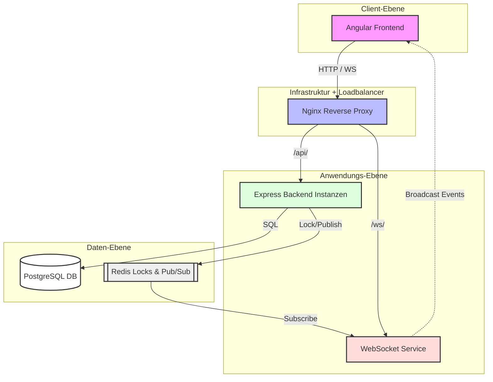

# Systemarchitektur

Dieses Diagramm zeigt die Interaktion der verschiedenen Services in deinem Projekt.

## Komponentenübersicht

1. **Angular Frontend**: Benutzeroberfläche.
2. **Nginx Reverse Proxy**: Verteilt Anfragen (Load Balancing & Routing).
3. **Express Backend**: Verarbeitet die Business-Logik und Datenzugriffe.
4. **WebSocket Service**: Sendet Echtzeit-Updates an die Clients.
5. **Redis**: Zentraler Speicher für Task-Sperren und Nachrichten-Bus.
6. **PostgreSQL**: Permanente Datenspeicherung.
